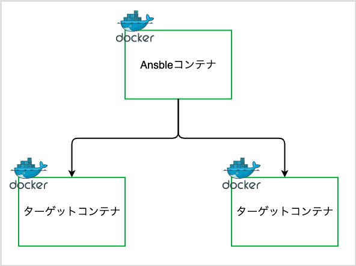

# Docker_and_Ansible

- Ansibleコンテナとターゲットコンテナを生成
- Ansibleコンテナからターゲットコンテナに対してplaybookを実行

## 手順
```bash
git clone 
cd dockerfiles
docker-compose up -d --build
docker exec -it ansible /bin/bash
ansible-playbook -i hosts playbook.yml
```

## 参考
[【Ansible】DockerでAnsibleハンズオン](https://qiita.com/knaot0/items/39eeefa5de652b857372)
